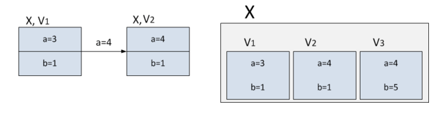
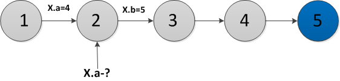

# smp_final_project
Repo for smp final project course at NSU

Проект по СМП: Persitent data structures (Неизменяемые структуры данных)

# Выполняли
Евдокимова Дарья 25221 - массив + двусвязный список   
Пальчунова Олеся 25221 - ассоциативный массив

# Требования 1
Реализуйте библиотеку со следующими структурами данных в persistent-вариантах:
- Массив (константное время доступа, переменная длинна)
- Двусвязный список
- Ассоциативный массив (на основе Hash-таблицы, либо бинарного дерева)

Требуется собственная реализация перечисленных структур. Найти соответствующие алгоритмы также является частью задания. Язык реализации не фиксируется, но рекомендуется Java/C#/C++. Для языков типа Clojure или Haskell задание бессмысленно, т.к. такие структуры и так встроены в язык. В динамических языках (Python, Ruby, JS и т.п.) реализация будет слишком медленная и неэффективная. В базовом варианте решения все
структуры данных могут быть сделаны на основе fat-node.

# Требования 2
Должен быть единый API для всех структур, желательно использовать естественный API для выбранной платформы

# Дополнительные требования
- Обеспечить произвольную вложенность данных (по аналогии с динамическими
языками), не отказываясь при этом полностью от типизации
посредством generic/template.
- Реализовать универсальный undo-redo механизм для перечисленных структур с
поддержкой каскадности (для вложенных структур)
- Реализовать более эффективное по скорости доступа представление структур данных, чем fat-node.


# Описание выполнения работы

## Что изучали
- [Статья 1](https://neerc.ifmo.ru/wiki/index.php?title=%D0%9F%D0%B5%D1%80%D1%81%D0%B8%D1%81%D1%82%D0%B5%D0%BD%D1%82%D0%BD%D1%8B%D0%B5_%D1%81%D1%82%D1%80%D1%83%D0%BA%D1%82%D1%83%D1%80%D1%8B_%D0%B4%D0%B0%D0%BD%D0%BD%D1%8B%D1%85)
- [Статья 2](https://arpitbhayani.me/blogs/persistent-data-structures-introduction/)
- [Статья 3](https://www.geeksforgeeks.org/dsa/persistent-data-structures/)
- [Статья 4](https://softwaremill.com/persistent-data-structures-in-functional-programming/)
- [Видос с csc](https://www.youtube.com/watch?v=cSiiVofy2Tw)


## Крактко по теории

### Определение
**Персистентные структуры данных (англ. persistent data structure)**
 —  это структуры данных, которые при внесении в них каких-то изменений сохраняют все свои предыдущие состояния и доступ к этим состояниям.

## Path Copying
Он же метод копирования пути заключается в копировании узла, в которого добавляется ребёнок, влоть до корня дерева.
Т.е. например у нас есть сбалансированное дерево поиска. Все операции в нем делаются за O(log n), где log(n) - высота дерева, n - количество вершин.

Взяли пример [отсюда](https://neerc.ifmo.ru/wiki/index.php?title=%D0%9F%D0%B5%D1%80%D1%81%D0%B8%D1%81%D1%82%D0%B5%D0%BD%D1%82%D0%BD%D1%8B%D0%B5_%D1%81%D1%82%D1%80%D1%83%D0%BA%D1%82%D1%83%D1%80%D1%8B_%D0%B4%D0%B0%D0%BD%D0%BD%D1%8B%D1%85) немного:
Пусть необходимо сделать какое-то обновление в этом сбалансированном дереве, например, добавить очередной элемент, но при этом нужно не потерять старое дерево. Возьмем узел, в который нужно добавить нового ребенка. Вместо того чтобы добавлять нового ребенка, скопируем этот узел, к копии добавим нового ребенка, также скопируем все узлы вплоть до корня, из которых достижим первый скопированный узел вместе со всеми указателями. Все вершины, из которых измененный узел не достижим, мы не трогаем. Количество новых узлов всегда будет порядка логарифма. В результате имеем доступ к обеим версиям дерева.


Этот метод хорошо работает на стеке, двоичных (декартовых, красно-черных) деревьях. Но в случае преобразования очереди в персистентную операция добавления будет очень дорогой, так как элемент добавляется в хвост очереди, который достижим из всех остальных элементов. Также не выгодно применять этот метод и в случае, когда в структуре данных имеются ссылки на родителя.

Поэтому далее рассматриваем Fat Node.

## Fat Node
Идея "Толстого узла" заключатеся в том, что в узле мы храним все предудущие и текущую версию, с указанием того, какие предки и т.д.



Н-р, у нас есть узел X, где в 1й версии значение a = 3, а во 2й версии значение a=4. И в узде содержится информация и о 1й, и о 2й версиях и тд.

Пусть нужно сделать запрос ко второй версии структуры данных.



Чтобы сделать этот запрос, нужно зайти в узел X и найти в списке версий максимальную версию, которая меньше или равна версии запроса. В примере на рисунке это версия 2, и в этой версии узла найти значение поля a
(в примере a=4). 
Чтобы быстро найти нужную версию в списке версий, хранящихся в «толстом» узле, нужно хранить их в виде дерева.   
Тогда мы сможем за логарифм найти нужную версию и к ней обратиться. Значит, все операции, которые будут производиться на этой структуре данных, будут домножаться на логарифм от числа версий.

## Алгоритм
Основные статьи:
- [J.R. Driscoll, Neil Sarnak, D.D. Sleator, R.E Tarjan Making Data Structures Persistent](https://www.cs.cmu.edu/~sleator/papers/another-persistence.pdf) - в пдфке прикреплено в директорию `articles`
- [Advanced Algorithms Persistent Data Structures](https://ocw.mit.edu/courses/6-854j-advanced-algorithms-fall-2005/resources/lec05_1999/) - в пдфке прикреплено в директорию `articles`


Алгоритм основан на узле, содержащем ссылку на левый узел, правый узел, значение в узле, а так же информацию о модификации левого узла, правого узла, или значения, а так же версию начиная с которой это изменение было применено.


Для реализации структур данных на основе такого подхода, была реализована вспомогательная структура [ModificationBoxNode<T, V extends Comparable<V>>](persistent-data-structure-lib/src/main/java/ru/nsu/ccfit/persistent/data/structure/node/ModificationBoxNode.java)

## Единый API
В качестве единого API создан интерфейс
```java
/**
 * Структура данных поддерживающая операции возврата к предыдущему состоянию.
 */
public interface PersistentStructure {

    /**
     * Выполняет возврат к предыдущей версии.
     */
    void undo();


    /**
     * Отменяет возврат к предыдущей версии.
     */
    void redo();

}
```

```java
/**
 * Обновляемый узел.
 *
 * @param <T> Тип значения в узле.
 * @param <V> Тип значения версии.
 */
public class ModificationBoxNode<T, V extends Comparable<V>> {

    /**
     * Возвращает значение левого узла в запрашиваемой версии.
     *
     * @param version Версия.
     * @return Значение левого узла в запрашиваемой версии.
     */
    public ModificationBoxNode<T, V> getLeft(V version) { ... }

    /**
     * Возвращает значение правого узла в запрашиваемой версии.
     *
     * @param version Версия.
     * @return Значение правого узла в запрашиваемой версии.
     */
    public ModificationBoxNode<T, V> getRight(V version) { ... }

    /**
     * Возвращает значение в запрашиваемой версии.
     *
     * @param version Версия.
     * @return Значение в запрашиваемой версии.
     */
    public T getValue(V version) { ... }

    /**
     * Возвращает текущую модификацию узла.
     *
     * @return Текущую модификацию узла.
     */
    public ModificationBox<T, V> getModificationBox() { ... }

    /**
     * Возвращает обновленный узел.
     *
     * @param modification Обновление.
     * @return Обновленный узел.
     */
    public ModificationBoxNode<T, V> modify(ModificationBox<T, V> modification) { ... }

    /**
     * Удаляет из узла информацию о всех модификациях совершенных в версиях выше указанной.
     *
     * @param version Версия.
     */
    public void cleanFromVersion(V version) { ... }

}
```

На основе такой структуры данных реализованы структуры:
- Двусвязный список
- Ассоциативный массив

### Массив
[PersistentArray\<E>](persistent-data-structure-lib/src/main/java/ru/nsu/ccfit/persistent/data/structure/array/PersistentArray.java) реализует естественный для Java интерфейс List<E>
и основывается на структуре [ArrayHead\<E>](persistent-data-structure-lib/src/main/java/ru/nsu/ccfit/persistent/data/structure/array/utils/ArrayHead.java) - используем path copying

### Двусвязный список
[PersistentDoubleLinkedList\<V>](persistent-data-structure-lib/src/main/java/ru/nsu/ccfit/persistent/data/structure/list/PersistentDoubleLinkedList.java) реализует естественный для Java интерфейс List<V>
и основывается на структуре [ModificationBoxNode<V, Long>](persistent-data-structure-lib/src/main/java/ru/nsu/ccfit/persistent/data/structure/node/ModificationBoxNode.java)

### Ассоциативный массив
[PersistentMap<K, V>](persistent-data-structure-lib/src/main/java/ru/nsu/ccfit/persistent/data/structure/map/PersistentMap.java) реализует естественный для Java интерфейс Map<K, V>
и основывается на структуре [ModificationBoxNode<Map.Entry<K, V>, Long>](persistent-data-structure-lib/src/main/java/ru/nsu/ccfit/persistent/data/structure/node/ModificationBoxNode.java)
